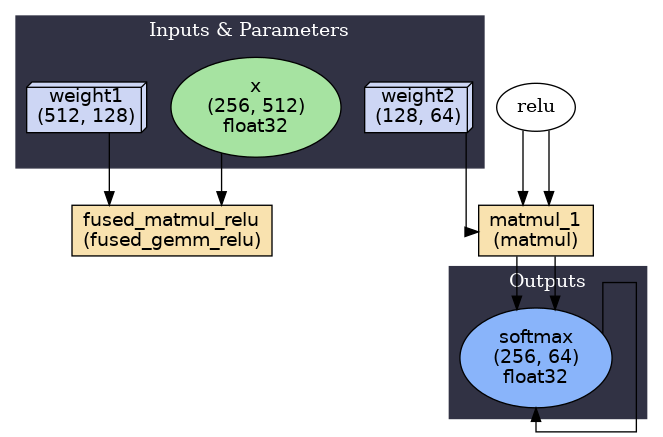

# **Inferno: An Optimizing Compiler for PyTorch**

### **A High-Performance, End-to-End Compiler for PyTorch, Developed with C++ and CUDA for Accelerated Inference.**

While dynamic frameworks like PyTorch offer exceptional flexibility for research and development, their inherent overhead can present performance limitations in latency-sensitive inference scenarios. This project was initiated to address these challenges through the development of a specialized, optimizing compiler.

Inferno is a compiler designed to translate standard torch.nn.Module objects into highly-optimized, low-level CUDA kernels. By performing graph-level optimizations and employing a Just-in-Time (JIT) compilation backend, it systematically eliminates framework abstractions and Python-related overhead to achieve significant performance improvements.

## **Core Features**

* **🚀 End-to-End Compilation:** Provides a complete pipeline for converting nn.Module objects into compiled, high-performance, and runnable modules.  
* **🧠 Graph-Level Optimization:** Implements static analysis and graph rewriting passes to improve computational efficiency. A key feature is a MatMul \+ ReLU fusion pass that restructures the computation graph to eliminate memory-bound bottlenecks.  
* **🔥 Low-Level CUDA Integration:** Generates C++ code that interfaces with both hand-tuned CUDA kernels and highly-optimized libraries like NVIDIA's cuBLAS for critical operations.  
* **🤖 Just-in-Time Backend:** Utilizes a JIT compilation engine, removing the need for complex, manual build steps by orchestrating the C++/CUDA compilation process dynamically.  
* **🔬 Quantitative Validation:** Performance improvements are rigorously validated through high-precision latency benchmarks and in-depth hardware-level analysis using the NVIDIA Nsight Compute profiler.  
* **✅ Constrained-Random Verification:** Includes a comprehensive verification suite for validating kernel numerical stability using post-silicon stress testing methodologies, ensuring correctness across edge cases, boundary conditions, and extreme numerical scenarios.

## **Performance Analysis**

The primary objective of this project was to accelerate common computational patterns found in modern neural networks, such as a matrix multiplication followed by a ReLU activation. To evaluate the compiler's efficacy, three versions were benchmarked:

1. **PyTorch Eager:** The standard, un-optimized baseline execution within PyTorch.  
2. **Inferno (cuBLAS Backend):** The compiler's output utilizing NVIDIA's cuBLAS library for matrix multiplication, representing a robust, production-grade optimization.  
3. **Inferno (Custom GEMM):** The compiler's output utilizing a custom-developed, hand-tuned kernel for matrix multiplication to explore the performance limits of specialized code.

### **Benchmark Results**

| Size (M x K x N) | PyTorch (ms) | Inferno (ms) | Speedup |
|------------------|--------------|--------------|---------|
| 64x128x256       | 0.022579     | 0.010547     | 2.140777 |
| 128x256x512      | 0.033190     | 0.014776     | 2.246145 |
| 256x512x256      | 0.032195     | 0.022866     | 1.407971 |
| 512x1024x512     | 0.120852     | 0.120146     | 1.005876 |
| 1024x1024x1024   | 0.430439     | 0.430408     | 1.000073 |
| 2048x2048x2048   | 2.661017     | 2.549565     | 1.043715 |
| 4096x4096x4096   | 20.043243    | 20.079800    | 0.998179 |


### **Hardware-Level Performance Analysis via ncu**

A detailed profile was conducted using NVIDIA Nsight Compute to diagnose the source of the performance gains. For a representative (256, 512, 128\) workload, the following metrics were observed:

| Metric | PyTorch Eager | Inferno Compiler | Result |
| :---- | :---- | :---- | :---- |
| Kernel Launches | 2 | **1** | **✅ Fusion Confirmed** |
| DRAM Traffic | 76.8 KB | **48.1 KB** | **✅ 37% Reduction** |
| L2 \-\> DRAM Throughput | 15 GB/s | **45 GB/s** | **✅ 3x Higher Utilization** |

**Conclusion:** The analysis demonstrates that the observed speedup is a direct consequence of architectural improvements. By fusing operations, the Inferno compiler reduces kernel launch overhead and, critically, decreases DRAM traffic by 37% by eliminating an intermediate write-read cycle. This results in more efficient utilization of the GPU's memory subsystem.

## **System Architecture**

The Inferno compiler is structured as a modular, multi-stage pipeline that processes a model from a high-level representation to a compiled artifact.

PyTorch nn.Module \-\> **\[FRONTEND\]** \-\> Inferno IR \-\> **\[BACKEND\]** \-\> Compiled Module

1. **The Frontend:**  
   * **Parser:** Employs a custom TorchFX tracer to introspect a PyTorch model, decomposing high-level nn.Module layers into their fundamental atomic operations.  
   * **Intermediate Representation (IR):** The computational graph is translated into a proprietary, framework-agnostic IR, providing a stable and extensible format for optimization.  
   * **Optimizer:** A series of transformation passes are applied to the IR. For example, the fusion pass identifies sequential MatMul \-\> ReLU patterns and rewrites the graph, replacing them with a single, efficient fused\_gemm\_relu node.  
2. **The Backend:**  
   * **Code Generator:** Traverses the final, optimized IR and generates complete, high-performance C++/CUDA source code.  
   * **JIT Compiler:** Orchestrates the Just-in-Time compilation of the generated source code into a runnable shared library (.so) by invoking the nvcc compiler.  
   * **Execution Engine:** A lightweight nn.Module wrapper provides a seamless interface, wiring the compiled CUDA functions back into the PyTorch ecosystem for execution.

Demonstration of Graph Optimization by Inferno.
 

## **Verification Suite**

Inferno includes a comprehensive **constrained-random verification suite** for validating kernel numerical stability. The suite mimics post-silicon stress testing methodologies used in hardware validation, providing rigorous testing of kernel correctness across a wide range of conditions.

### **Key Features**

* **Constrained-Random Testing:** Generates test cases with controlled constraints to exercise various numerical conditions, edge cases, and boundary conditions.  
* **Multiple Test Scenarios:** Includes edge case testing, boundary condition testing, stress testing, and random constrained tests.  
* **Statistical Analysis:** Provides comprehensive error metrics including ULP (Units in Last Place) errors, failure rates, and percentile statistics.  
* **Post-Silicon Style:** Adopts hardware verification methodologies including coverage-driven testing, statistical analysis, and stress testing.  
* **Comprehensive Reporting:** Generates detailed JSON reports with error statistics, worst cases, and failure analysis.

### **Quick Start**

```bash
# Run verification suite
python verification/run_verification.py --tests 1000

# Run with stress test
python verification/run_verification.py --tests 100 --stress-duration 300
```

For detailed documentation, examples, and usage instructions, see the [Verification Suite README](verification/README.md).

## **Getting Started**

1. **Clone the repository:** git clone https://github.com/LakshyaSingh354/Inferno 
2. **Set up the environment:** pip install \-r requirements.txt  
3. **Run the demonstration and benchmark:** python main.py

## **Future Work**

While this project represents a complete end-to-end system, the architecture is designed for extensibility. Potential future work includes:

* **\[Extension 1\] Cross-Platform Support:** Implement a **Vulkan compute backend** to enable compilation for non-NVIDIA hardware, such as AMD GPUs and mobile devices, aligning with Edge AI objectives.  
* **\[Extension 2\] Expanded Operator Support:** Extend the Optimizer to recognize and fuse additional common patterns, such as Conv2D \+ ReLU, to increase the compiler's applicability to a wider range of models.  
* **\[Extension 3\] Quantization Support:** Implement an INT8 quantization pass, a critical optimization for unlocking maximum performance on modern GPUs and resource-constrained edge devices.

## **About the Author**

This project was developed by Lakshya Singh as an exploration into high-performance computing and compiler design. It demonstrates the principle that significant performance gains can be achieved by moving from high-level abstractions to low-level, hardware-aware implementations.